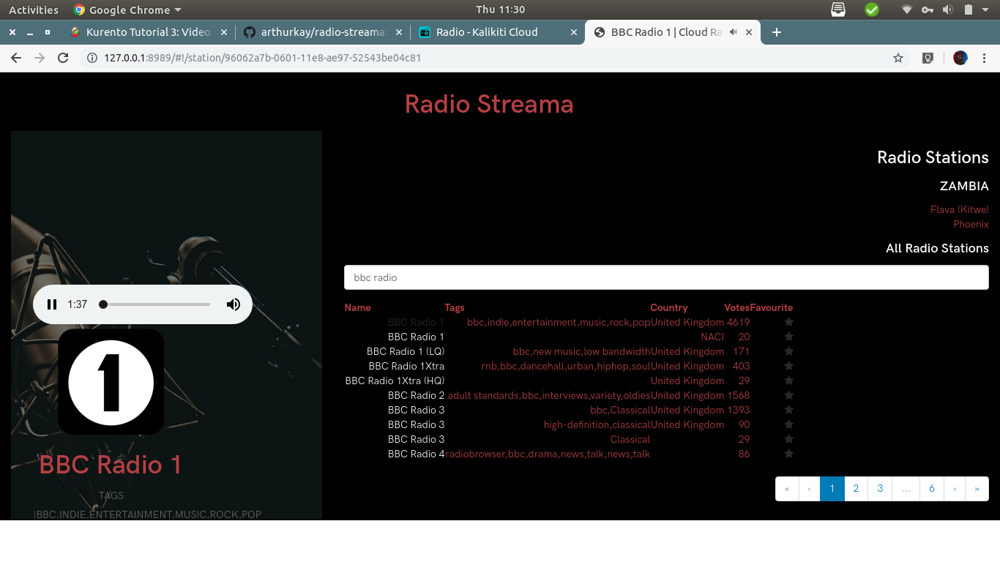

# Radio Streama

## INTRODUCTION

Radio Streama is a super lightweight javascript radio streaming web application written in NodeJs.
The application uses AngularJs for the frontend and ExpressJs for the backend.
The application has been built to be a standalone web application that only requires one to have nodejs installed on their development machine or server.

## INSTALLATION

To run this application, make sure you have nodejs already installed.
After installation of NodeJs, head over to the path of this app, e.g.

```bash
cd /path/where/app/is/located/radio-streama
npm install
```

Also make sure you have a `.env` file that contains the port number you want the app to listen on.
This can be done by creating `.env` in your working directory.

```bash
cd /path/where/app/is/located/radio-streama
touch .env
```

And adding the following to the file:

```.env
# .env file
PORT=8989
```

That will install all required node modules for the application to run.

## RUN THE APP

To run the app, head to the directory where the app is, i.e

```bash
cd /path/to/where/the/app/is/located/radio-streama
npm run start
```

*NOTE:* This is a streaming app, so you'll need an internet connection to use the app or you'll only be able to see a screen such as below (without radio stations), indicating that radio stations couldn't be fetched.



## LICENSE

This is an open source project released under the MIT licence, meaning anyone with access to this code can literally do whatever pleases them with the code.
The author(s) of this source code, do not in any way assume any lose and/or damanage that may arise from the use or acquisition of this software.

## CONTRIBUTING

Currently the platform is being maintained by a single developer, if you have any feature request and/or want to add a few whistles and bells, feel free to contact [Arthur Kalikiti](https://github.com/arthurkay) for a quick discussion of how best to integrate your pull request in the app.
